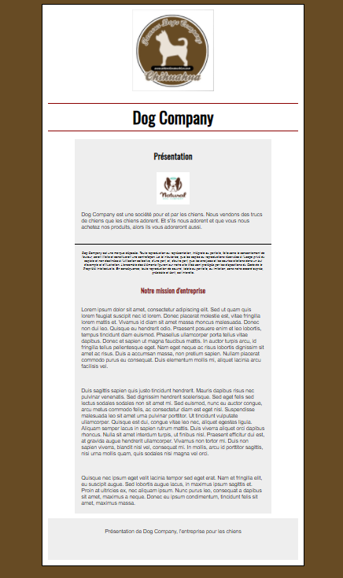
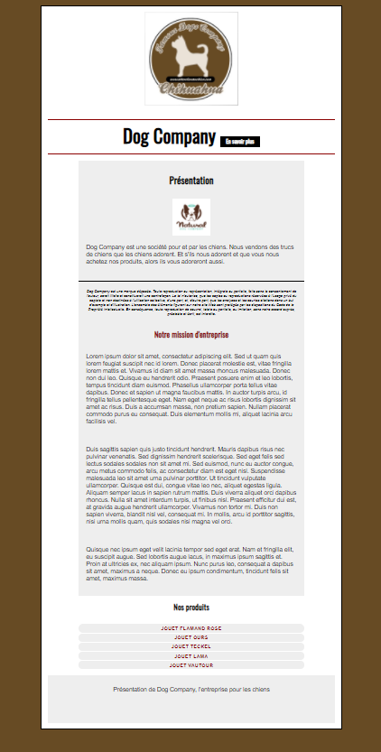
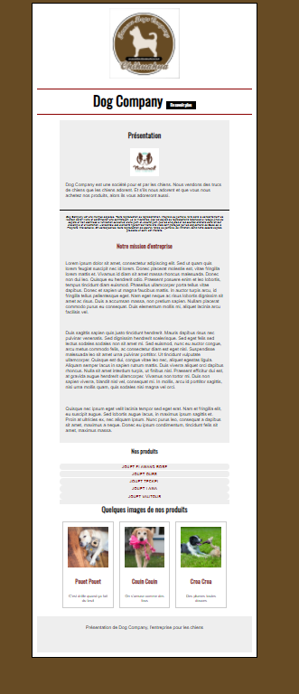

# Exercice Page entreprise

Objectif : comprendre la notion de bloc et le concept de Box-model :boom:

Ressources : 

* [Les éléments de bloc en html](https://developer.mozilla.org/fr/docs/Web/HTML/%C3%89l%C3%A9ments_en_bloc)

* [Les éléments de ligne en html](https://developer.mozilla.org/fr/docs/Web/HTML/%C3%89l%C3%A9ments_en_ligne)

* [Le box model c'est quoi ?](https://developer.mozilla.org/fr/docs/Apprendre/CSS/Building_blocks/Le_modele_de_boite)

* [Padding c'est quoi ?](https://developer.mozilla.org/en-US/docs/Web/CSS/padding)

* [Margin c'est quoi ?](https://developer.mozilla.org/fr/docs/Web/CSS/margin)

Pour mémo :

[La sémantique en html c'est quoi ?](https://developer.mozilla.org/fr/docs/Glossaire/S%C3%A9mantique) 

## Instructions

- Les textes sont dispo dans le fichier `textes.txt`
- Les visuels sont disponibles dans le dossier `images` du projet
- Il faut reproduire l'intégration ci-dessous. L'ensemble du html et du css sont à faire
- une feuille de style reset.css est fournie. Elle doit être utilisée pour réinitialiser à "0" les styles automatiques du navigateur
- La couleur de background est #674B24
- La couleur de background du contenu est #EEEEEE
- La couleur des lignes et de certains titres est darkred
- la police du body est Arial, Helvetica, sans serif

## BONUS

- Ajouter un bloc `En savoir plus` dans le titre
- Utiliser la font Oswald pour garantir le rendu des titres, un tour sur [Google fonts](https://fonts.google.com/) - On a vu ensemble comment faire
- Afficher la liste des produits
- Un lien vers un site distant doit être placé sur chaque produit, le lien doit s'ouvrir dans une page différente

## SUPER BONUS
 
- Les liens survolés doivent réagir (fond et couleur en respectant l'arrondi)
- Gérer les blocs d'images 

